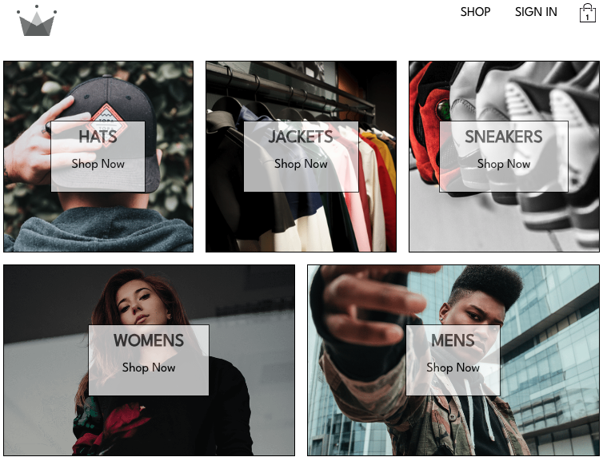

### [🔗 Click here to see this project deployed live!](https://nick-abate-ecommerce-app.netlify.app/)

# CRWN CLOTHING

CRWN Clothing is an e-commerce store project.

This project challenged me to take my knowledge in React to a new level. The project was built as part of pursuing my online certification as a React developer with the [Zero to Mastery Academy](https://zerotomastery.io/).

With this project, I learned how to use third party libraries to build efficient and modern experiences for users.

## Built With

Some of the tech used in this app includes Firebase to store the product categories, products, and user accounts. Redux has been used to manage centralized application state for things like a user's logged in status and the user's shopping cart. Lastly, the Stripe API has been integrated to simulate payments for a user's purchases.

- [React](https://reactjs.org/) - JS library for web user interfaces
- [Redux](https://redux.js.org/) - JS library for predictable and maintainable global state management
- [Firebase](https://firebase.google.com/) - Backend cloud computing services
- [Stripe](https://docs.stripe.com/) - Payment gateway service 

## Contributing Author

Thanks for checking out my work! Feel free to reach out to me with any questions or to connect.

- Portfolio - [Live Site](https://nickabate.dev/)
- LinkedIn - [Nick Abate](https://www.linkedin.com/in/nick-abate/)
- Twitter - [@thatdevnick](https://twitter.com/thatdevnick)
